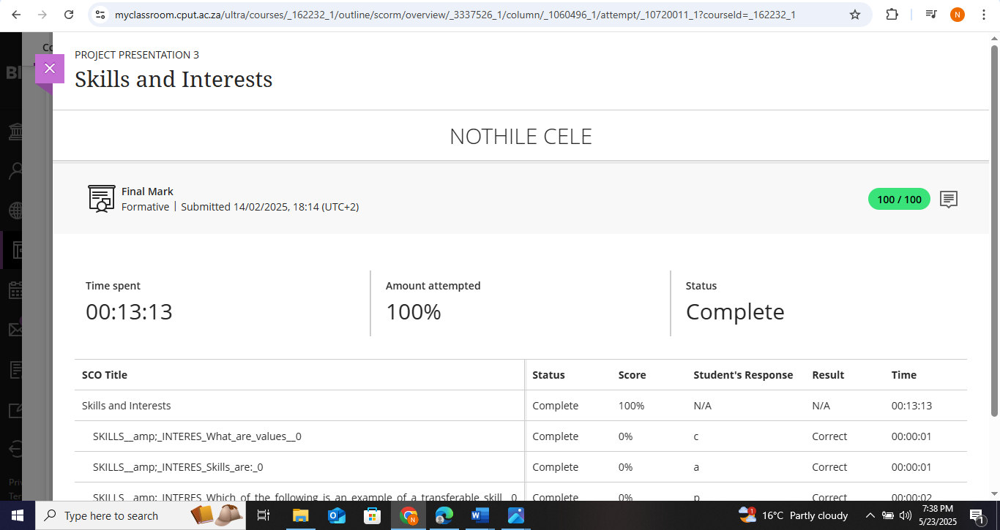
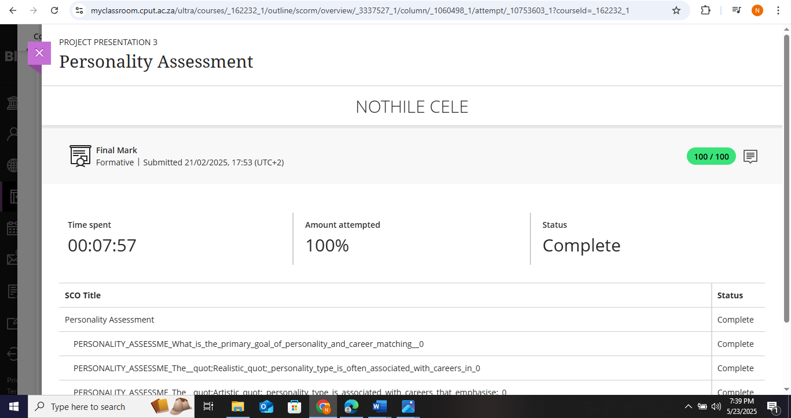
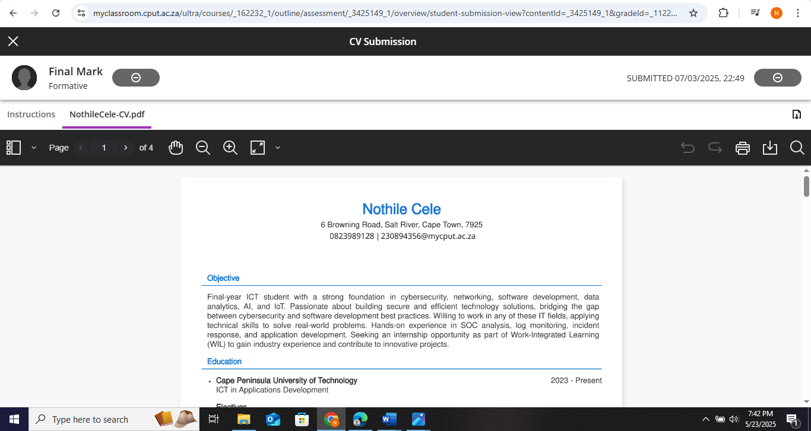

# Digital Portfolio: Work Readiness  
**Name:** Nothile Cele  
**Course:** Diploma in ICT in Applications Development

**Module:** Project Presentation 3

---

## 1. Career Counselling  
### Evidence  
-  

### Reflection  
**Situation:** I completed a career counselling module as part of this module to identify suitable career paths.  
**Task:** The goal was to answer questions honestly to get accurate job recommendations.  
**Action:** I considered what I learn't, researched unfamiliar career options, and compared results with my interests.  
**Result:** I discovered careers that align with my strengths, which helped me focus my job search.  

---

## 2. Skills and Interests  
### Evidence  
-  

### Reflection   
**Situation:** The skills and Interests module encouraged me to know my skills and values.  
**Task:** I needed to identify my strongest skills and how they apply to real jobs.  
**Action:** I reviewed my result and researched how to improve weaker areas.  
**Result:** Now I understand which jobs match my skills and where I need more practice.  

---

## 3. Personality Assessment  
### Evidence  
-    

### Reflection   
**Situation:** I reviewed my personality type to learn how I work best.  
**Task:** The module required me to answer questions about my preferences in work and social settings.  
**Action:** I read the results carefully and compared them to careers suited for my personality type.  
**Result:** I learned which roles which roles I do best in, which will guide my future job applications.  

---

## 4. Create a CV  
### Evidence  
- [Create a CV](createCV.png)  

### Reflection 
**Situation:** I had to create a professional CV for IT job applications.  
**Task:** The goal was to highlight my education, skills, and projects clearly.  
**Action:** I used a template, listed my qualifications and projects, and asked a friend to review it.  
**Result:** Now I have a professional CV ready to send to employers, and I understand what recruiters look for.  

---

## 5. CV Submission  
### Evidence  
-  

### Reflection  
**Situation:** I submitted my CV on Blackboard.  
**Task:** I needed to ensure my CV was error-free and tailored to the jobs I am looking for.  
**Action:** I double-checked my CV, adjusted keywords, and uploaded it.  
**Result:** I gained confidence in applying for real jobs and receiving feedback from recruiters.  

---

