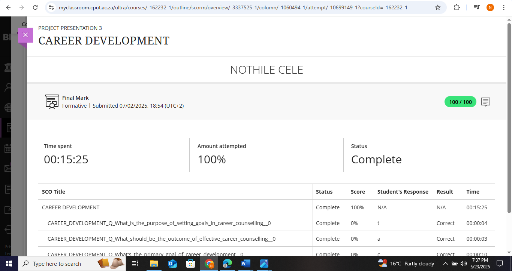
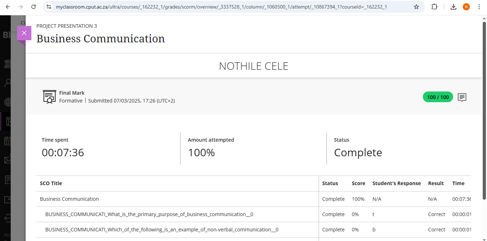
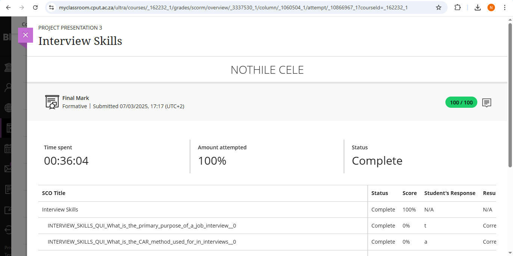
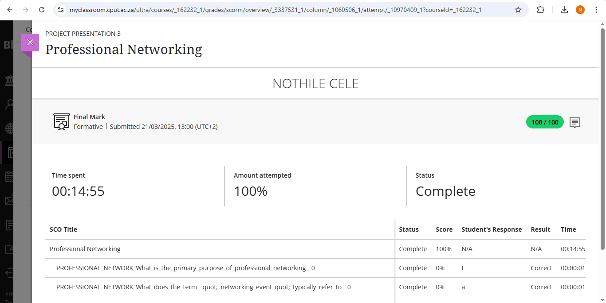
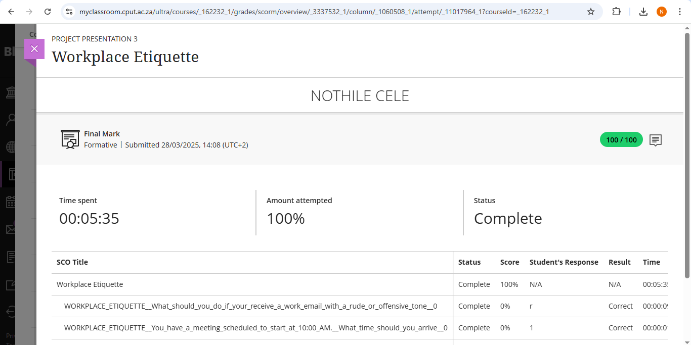

# Digital Portfolio: Work Readiness  
**Name:** Nothile Cele  
**Course:** Diploma in ICT in Applications Development

**Module:** Project Presentation 3

---

## 1. Career Counselling  
### Evidence  
-  

### Reflection  
**Situation:** I completed a career counselling module as part of this module to identify suitable career paths.  
**Task:** The goal was to answer questions honestly to get accurate job recommendations.  
**Action:** I considered what I learn't, researched unfamiliar career options, and compared results with my interests.  
**Result:** I discovered careers that align with my strengths, which helped me focus my job search.  

---

## 2. Skills and Interests  
### Evidence  
-  

### Reflection   
**Situation:** The skills and Interests module encouraged me to know my skills and values.  
**Task:** I needed to identify my strongest skills and how they apply to real jobs.  
**Action:** I reviewed my result and researched how to improve weaker areas.  
**Result:** Now I understand which jobs match my skills and where I need more practice.  

---

## 3. Personality Assessment  
### Evidence  
-    

### Reflection   
**Situation:** I reviewed my personality type to learn how I work best.  
**Task:** The module required me to answer questions about my preferences in work and social settings.  
**Action:** I read the results carefully and compared them to careers suited for my personality type.  
**Result:** I learned which roles which roles I do best in, which will guide my future job applications.  

---

## 4. Create a CV  
### Evidence  
- [Create a CV](createCV.png)  

### Reflection 
**Situation:** I had to create a professional CV for IT job applications.  
**Task:** The goal was to highlight my education, skills, and projects clearly.  
**Action:** I used a template, listed my qualifications and projects, and asked a friend to review it.  
**Result:** Now I have a professional CV ready to send to employers, and I understand what recruiters look for.  

---

## 5. CV Submission  
### Evidence  
-  

### Reflection  
**Situation:** I submitted my CV on Blackboard.  
**Task:** I needed to ensure my CV was error-free and tailored to the jobs I am looking for.  
**Action:** I double-checked my CV, adjusted keywords, and uploaded it.  
**Result:** I gained confidence in applying for real jobs and receiving feedback from recruiters.  

---

## 6. Business Communication
### Evidence  
- 

### Reflection   
**Situation:** I completed the business communication module to improve my professional interactions.  
**Task:** I needed to learn how to communicate effectively in workplace settings, including emails and meetings.  
**Action:** I practiced writing professional emails, learned about tone and structure, and participated in communication exercises.  
**Result:** I now feel more confident writing professional communications and understand the importance of clear business language.  

---

## 7. Interview Skills
### Evidence  
- 

### Reflection   
**Situation:** I completed interview skills training to prepare for job interviews.  
**Task:** The goal was to learn how to answer common interview questions effectively.  
**Action:** I practiced answering behavioral questions, researched company backgrounds, and prepared my own questions to ask interviewers.  
**Result:** I feel much more prepared for real interviews and I now understand how to structure my answers using examples.  

---

## 8. Mock Interview
### Evidence  
- 

### Reflection  
**Situation:** I participated in a mock interview as practice for real job interviews.  
**Task:** I had to treat it like a real interview and demonstrate my skills and knowledge.  
**Action:** I dressed professionally, researched common interview questions, and answered them using the STAR technique I learned.  
**Result:** I received feedback on my strengths and areas to improve, which will help me in actual interviews.  

---

## 9. Professional Networking
### Evidence  
- 

### Reflection   
**Situation:** In this module I learned about professional networking and how to build industry connections.  
**Task:** I needed to understand how to network effectively both online and in person.  
**Action:** I created/updated my LinkedIn profile, attended networking event, and learned networking etiquette.  
**Result:** I now have a professional online presence and understand how to make meaningful career connections.  

---

## 10. Workplace Etiquette
### Evidence  
- 

### Reflection  
**Situation:** In this module I had to complete training on workplace etiquette and professional behavior.  
**Task:** I needed to learn appropriate conduct in professional environments.  
**Action:** I studied topics like punctuality, dress code, communication with colleagues, and meeting etiquette.  
**Result:** I now understand professional workplace expectations and feel prepared to conduct myself appropriately in any job setting.  
